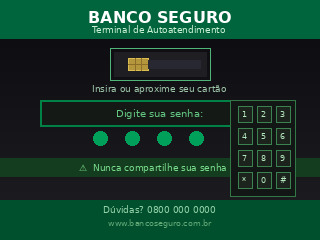
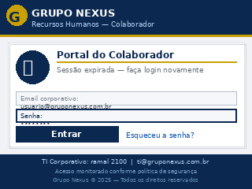
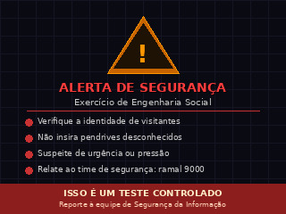
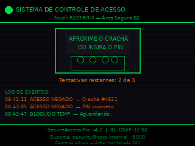

<div align="center">

# OSEP-32 (SYH2)
### Offensive Social Engineering Platform


**Plataforma de engenharia social ofensiva baseada em ESP32 com display TFT 320×240, controle remoto via Wi-Fi, servidor FTP integrado e painel web de administração.**

</div>

---

## 📋 Índice

- [Proposta do Projeto](#-proposta-do-projeto)
- [Funcionalidades](#-funcionalidades)
- [Hardware](#-hardware)
- [Pinagem Interna (ESP32-2432S028R)](#-pinagem-interna-esp32-2432s028r)
- [Instalação do Firmware](#-instalação-do-firmware)
- [Configuração da TFT_eSPI](#-configuração-da-tft_espi)
- [Bibliotecas Necessárias](#-bibliotecas-necessárias)
- [Arquitetura do Firmware](#-arquitetura-do-firmware)
- [API REST](#-api-rest)
- [Guia de Operação](#-guia-de-operação)
- [Script osep_sender.py](#-script-osep_senderpy)
- [Credenciais Padrão](#-credenciais-padrão)
- [Aviso Legal](#-aviso-legal)

---

## 🎯 Proposta do Projeto

O **OSEP-32** é uma ferramenta de engenharia social ofensiva desenvolvida para profissionais de segurança e pentesters que atuam em exercícios de **Red Team** e avaliações de segurança física.

O dispositivo exibe sequências de imagens JPEG (campanhas de phishing visuais) em um display TFT compacto, sendo controlado remotamente via Wi-Fi através de um painel web protegido por senha. Opera de forma **totalmente autônoma**, sem dependência de rede externa, criando seu próprio ponto de acesso Wi-Fi.

### Casos de Uso

- 🏧 Simulação de terminais de pagamento / ATMs com telas de phishing
- 🏢 Kiosks falsos em eventos corporativos exibindo QR codes maliciosos
- 📋 Displays informativos em lobbies capturando credenciais
- 🎓 Treinamentos de conscientização interna (Blue Team awareness)
- 🔍 Avaliações de segurança física com vetor visual

## 🖼️ Slides de Exemplo

<table>
  <tr>
    <td align="center">
      <br/>
      <sub>🏧 ATM / Terminal de Pagamento</sub>
    </td>
    <td align="center">
      <br/>
      <sub>🏢 Kiosk Corporativo com QR Code</sub>
    </td>
    <td align="center">
      <br/>
      <sub>📋 Portal de Lobby / Captura de Credenciais</sub>
    </td>
  </tr>
  <tr>
    <td align="center">
      <br/>
      <sub>🎓 Blue Team Awareness</sub>
    </td>
    <td align="center">
      <br/>
      <sub>🔍 Controle de Acesso Físico</sub>
    </td>
    <td align="center">
      <i>Adicione seus próprios slides<br/>via FTP → /slides</i>
    </td>
  </tr>
</table>

---

## ⚡ Funcionalidades

| Funcionalidade | Descrição |
|---|---|
| **Slideshow automático** | Exibe imagens JPEG em sequência com delay configurável (1–30 s) |
| **Pausa de slideshow** | Toggle remoto para fixar uma imagem na tela sem atualização |
| **Exibição forçada** | Exibe imediatamente uma imagem específica pelo painel web |
| **Servidor FTP** | Recebe imagens via FTP na porta 21 (sem upload HTTP problemático) |
| **Reload automático** | Recarrega a lista de imagens após transferência FTP |
| **Painel web** | Interface HTML/JS completa para controle remoto do dispositivo |
| **Autenticação** | Login por senha com token em todas as requisições de API |
| **Galeria web** | Visualização de thumbnails das imagens armazenadas no SD |
| **Reordenação** | Reordena imagens para definir a sequência do slideshow |
| **Exclusão remota** | Remove imagem do SD e da lista via painel web |
| **Config persistente** | Todas as configurações salvas no SD (`/config.txt`) |
| **Modo AP + STA** | Opera como AP standalone ou conectado a rede existente |
| **Controle de brilho** | PWM no backlight do display (1–255) via painel |
| **Mutex FreeRTOS** | Acesso seguro ao SD entre FTP, display e servidor web |
| **Ordem persistente** | Ordem das imagens salva em `/slides/order.txt` |

---

## 🔧 Hardware

O OSEP-32 é construído sobre a **ESP32-2432S028R** ("Cheap Yellow Display" / CYD) — uma placa all-in-one que integra ESP32, display ILI9341 2.8" 320×240, leitor de microSD e touch capacitivo em um único PCB. **Nenhuma fiação externa é necessária.**

### Lista de Componentes

| Componente | Especificação | Qtd. |
|---|---|:---:|
| **ESP32-2432S028R (CYD)** | ESP32 + Display ILI9341 2.8" 320×240 + SD card + touch — all-in-one | 1 |
| **Cartão microSD** | 8 GB (ou superior), formatado em FAT32 | 1 |
| **Cabo USB-C** | Para gravação do firmware e alimentação | 1 |
| **Case de acrílico** | Proteção e acabamento (opcional) | 1 |


> ✅ **Vantagem:** por ser uma placa all-in-one, basta inserir o cartão microSD, conectar o USB-C e gravar o firmware. Sem jumpers, sem protoboard, sem soldas.

---

## 📌 Pinagem Interna (ESP32-2432S028R)

> Todos os periféricos são internos ao PCB. A tabela abaixo é para referência de configuração do firmware e da biblioteca TFT_eSPI.

### Display TFT ILI9341

| GPIO (ESP32) | Função | Sinal |
|:---:|---|---|
| GPIO 14 | SPI Clock do display | TFT_SCLK |
| GPIO 12 | SPI MISO do display | TFT_MISO |
| GPIO 13 | SPI MOSI do display | TFT_MOSI |
| GPIO 15 | Chip Select do display | TFT_CS |
| GPIO 2  | Data / Command select | TFT_DC |
| GPIO 21 | Backlight PWM | TFT_BL |
| RST | Reset (ligado ao reset geral) | TFT_RST |

### Leitor microSD (barramento SPI separado)

| GPIO (ESP32) | Função | Sinal |
|:---:|---|---|
| GPIO 18 | SPI Clock do SD | SD_SCK |
| GPIO 19 | SPI MISO do SD | SD_MISO |
| GPIO 23 | SPI MOSI do SD | SD_MOSI |
| GPIO 5  | Chip Select do SD | SD_CS |

> ⚠️ **Importante:** na ESP32-2432S028R o display e o SD utilizam **barramentos SPI independentes** — diferente de montagens manuais onde os dois compartilham o mesmo barramento.

---

## 🚀 Instalação do Firmware

### Pré-requisitos

- [Arduino IDE 1.8.x](https://www.arduino.cc/en/software)
- ESP32 Board Support: `Arquivo > Preferências > URLs adicionais`:
  ```
  https://raw.githubusercontent.com/espressif/arduino-esp32/gh-pages/package_esp32_index.json
  ```
  Depois: `Ferramentas > Placa > Gerenciador de Placas` → instalar **esp32 by Espressif** (versão 3.3.8+)

### Passos

1. Formate o cartão microSD em **FAT32** e insira na placa
2. (Opcional) Monte a placa no case de acrílico
3. Conecte a placa ao computador via cabo USB-C
4. Instale as bibliotecas listadas na seção [Bibliotecas](#-bibliotecas-necessárias)
5. Configure o `User_Setup.h` da TFT_eSPI conforme a [seção de configuração](#-configuração-da-tft_espi)
6. Abra o arquivo `syh2_offensive_social_engineering_device.ino` no Arduino IDE
7. Selecione: `Ferramentas > Placa > ESP32 Dev Module`
8. Clique em **Upload**
9. Na primeira inicialização, o firmware cria automaticamente `/config.txt` e `/slides` no SD
10. Conecte ao AP Wi-Fi `OSEP-32(SYH2)` (senha: `solydsyh2`)
11. Acesse `http://192.168.4.1` e faça login com senha `solyd`

---

## ⚙️ Configuração da TFT_eSPI

Edite o arquivo `User_Setup.h` na pasta da biblioteca TFT_eSPI:

```cpp
#define ILI9341_DRIVER

// Display SPI (barramento dedicado — ESP32-2432S028R)
#define TFT_MISO 12
#define TFT_MOSI 13
#define TFT_SCLK 14
#define TFT_CS   15   // Chip select do display
#define TFT_DC    2   // Data/Command
#define TFT_RST  -1   // Reset ligado ao reset geral da placa
#define TFT_BL   21   // Backlight PWM

// SD Card usa barramento SPI separado (GPIOs 18/19/23/5)
// Configurado diretamente no firmware — não alterar aqui

#define SPI_FREQUENCY      27000000
#define SPI_READ_FREQUENCY 20000000
```

---

## 📦 Bibliotecas Necessárias

Instale via **Arduino Library Manager** (`Sketch > Incluir Biblioteca > Gerenciar Bibliotecas`):

| Biblioteca | Versão | Observação |
|---|---|---|
| ESP32 Arduino Core | 3.3.8+ | Via Board Manager |
| AsyncTCP | 1.1.4+ | — |
| ESPAsyncWebServer | 3.x+ | — |
| TFT_eSPI | 2.5.x+ | Requer configuração do `User_Setup.h` |
| TJpg_Decoder | 1.x+ | — |
| ESP32FtpServer | — | By **robo8080** |

---

## 🏗️ Arquitetura do Firmware

```
syh2_offensive_social_engineering_device.ino
│
├── Configuração        saveConfig() / loadConfig()
│                       Leitura e escrita de parâmetros no SD (/config.txt)
│
├── Imagens             loadImagesFromSD() / saveOrder()
│                       moveImage() / deleteImageByName()
│                       Lista ordenada de slides com mutex FreeRTOS
│
├── Display             drawImageByName() / drawStatusOverlay()
│                       Renderização JPEG via TJpg_Decoder + mutex SD
│
├── Rede                startWifi()
│                       Modo dual AP+STA com fallback automático
│
├── FTP                 startFtp()
│                       Servidor FTP porta 21 (ESP32FtpServer by robo8080)
│
├── Web                 startWeb()
│                       Servidor HTTP assíncrono — 11 rotas REST
│
└── Loop principal      Slideshow + pausa + exibição forçada + reload FTP
```

### Decisões Técnicas

**Mutex FreeRTOS para o SD**
O SD é acessado por três contextos simultâneos (loop, HTTP assíncrono e FTP). O `sdMutex` garante acesso exclusivo em todos os pontos de leitura e escrita, evitando corrupção de dados.

**Arrays globais para evitar Stack Overflow**
`images[]` e `found[]` (200 elementos `String` cada) são globais. A declaração local consumia ~5 KB de stack por chamada, causando boot loop.

**Mutex separado em saveConfig / saveOrder**
Essas funções não gerenciam o mutex internamente — o chamador é responsável. Evita deadlocks quando chamadas dentro de `loadImagesFromSD()` que já detém o mutex.

**Flag `ftpDirty` para reload assíncrono**
A `ESP32FtpServer` não oferece callback de transferência. O botão "Atualizar galeria" define a flag `ftpDirty`, e o loop principal executa o reload de forma segura fora de contextos de interrupção.

---

## 🌐 API REST

Todas as rotas protegidas exigem o parâmetro `token` com a senha do painel.

| Método | Endpoint | Descrição | Auth |
|:---:|---|---|:---:|
| `GET` | `/` | Página de login | ❌ |
| `GET` | `/panel` | Painel de controle | ✅ |
| `GET` | `/api/list` | Lista JSON de imagens | ✅ |
| `GET` | `/img?name=X` | Serve imagem JPEG do SD | ✅ |
| `POST` | `/api/show` | Exibe imagem imediatamente | ✅ |
| `POST` | `/api/pause` | Toggle pausa/retomada do slideshow | ✅ |
| `POST` | `/api/move` | Reordena imagem (params: from, to) | ✅ |
| `POST` | `/api/delete` | Remove imagem do SD | ✅ |
| `POST` | `/api/reload` | Força recarregamento da lista | ✅ |
| `POST` | `/api/config` | Salva configurações | ✅ |
| `POST` | `/api/reboot` | Reinicia o dispositivo | ✅ |

---

## 📖 Guia de Operação

### Primeiro Acesso

1. Ligue o dispositivo via USB-C ou fonte 5V
2. Aguarde a tela exibir o endereço IP (~3 segundos)
3. Conecte ao Wi-Fi `OSEP-32(SYH2)` — senha `solydsyh2`
4. Acesse `http://192.168.4.1` no browser
5. Faça login com a senha padrão: `solyd`

### Envio de Imagens via FTP

1. Abra o **FileZilla** ou **WinSCP**
2. Conecte: Host `192.168.4.1`, Porta `21`, Usuário `osep`, Senha `osep1234`
3. Navegue até `/slides`
4. Arraste as imagens JPEG para a pasta
5. No painel web, clique em **Atualizar galeria**

> 💡 **Dica:** use o script `osep_sender.py` para converter e enviar automaticamente qualquer imagem para o formato correto.

### Controle do Slideshow

| Ação | Efeito |
|---|---|
| **Mostrar agora** | Exibe a imagem imediatamente e para no índice correspondente |
| **⏸ Pausar slideshow** | Fixa a imagem atual na tela sem atualização |
| **▶ Retomar slideshow** | Volta ao ciclo automático a partir da imagem atual |
| **↑ / ↓** | Reordena a imagem na sequência do slideshow |
| **Excluir** | Remove permanentemente a imagem do SD card |

---

## 🐍 Script osep_sender.py

Script Python que monitora uma pasta local, converte qualquer imagem para o formato correto e envia automaticamente via FTP.

### Instalação

```bash
pip install pillow watchdog
```

### Uso

```bash
# Monitoramento contínuo (pasta padrão: ./para_enviar)
python osep_sender.py

# Com argumentos personalizados
python osep_sender.py --host 192.168.1.50 --watch ./imagens --done ./enviados

# Processar arquivos existentes e sair (sem monitorar)
python osep_sender.py --no-watch
```

### Funcionalidades

- 📁 Monitoramento contínuo de pasta via `watchdog`
- 🔄 Conversão automática para JPEG 320×240 baseline, qualidade 90
- 📱 Detecção e correção de rotação EXIF (fotos de celular)
- 🔃 Rotação automática de imagens em retrato para paisagem
- ⬛ Letterbox preto para proporções diferentes de 4:3
- 📤 Envio automático via FTP após conversão
- 🖼️ Suporte a: PNG, BMP, GIF, WebP, TIFF, JPEG

### Formatos aceitos como entrada

```
.jpg  .jpeg  .png  .bmp  .gif  .webp  .tiff  .tif
```

---

## 🔑 Credenciais Padrão

| Serviço | Usuário | Senha |
|---|---|---|
| Wi-Fi AP | `OSEP-32(SYH2)` | `solydsyh2` |
| Painel Web | *(token)* | `solyd` |
| FTP | `osep` | `osep1234` |

> 🔴 **SEGURANÇA:** altere todas as credenciais padrão antes de utilizar o dispositivo em campo. As configurações podem ser atualizadas pelo painel web e são salvas permanentemente no SD card.

---

## 📁 Estrutura do Repositório

```
osep-32/
├── syh2_offensive_social_engineering_device.ino   # Firmware principal
├── User_Setup.h                                    # Configuração TFT_eSPI para CYD
├── osep_sender.py                                  # Script de conversão e envio FTP
└── README.md                                       # Este arquivo
```

---

## ⚖️ Aviso Legal

Esta ferramenta foi desenvolvida **exclusivamente para fins educacionais e profissionais de segurança ofensiva**. O uso do OSEP-32 é permitido somente em ambientes autorizados, como laboratórios de segurança, exercícios de Red Team com escopo definido e treinamentos controlados.

**O uso não autorizado desta ferramenta contra sistemas ou pessoas sem consentimento explícito é ilegal e antiético.** Os autores não se responsabilizam por qualquer uso indevido.

---

<div align="center">

Desenvolvido para a certificação **SYH2 — Solyd Offensive Security**

</div>
